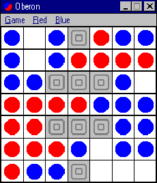

# Assegnazione Progetto

## Ataxx

- Il gioco si gioca su un tabellone quadrato, diviso in quadrati della stessa dimensione.
- Due giocatori si affrontano utilizzando pezzi di colori diversi (un colore per giocatore).
- Ogni giocatore inizia con due pezzi, i 4 pezzi sono negli angoli della piazza.
- Utilizzando movimenti orizzontali, verticali e diagonali, ogni pezzo può andare in una casella libera adiacente, dividendosi in due pezzi, oppure può saltare di   
  una casella per andare su una casella libera (senza dividersi).
- Ogni pezzo avversario adiacente alla casa di destinazione gira il suo colore (in direzione orizzontale, verticale e diagonale, finché è possibile toccare 8 pezzi).
- I giocatori si alternano a turno, effettuando una mossa per turno.
- Non puoi "passare" o saltare un turno, a meno che non sia intrappolato.
- Il vincitore è quello con più pezzi quando tutti i quadrati sono pieni. Può anche finire prima, quando un giocatore ha 0 pezzi o non può più giocare nemmeno nelle 
  mosse future (tuttavia, se un giocatore ha più della metà dei pezzi, e può riempire quelli liberi senza "dare" una cassa libera accessibile al suo avversario , il 
  gioco potrebbe essere terminato in questo momento).

