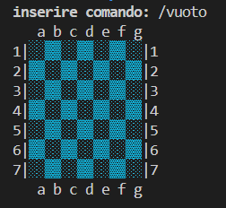

# Progetto Ataxx - Gruppo Codd
## Report
### Indice

1. [Introduzione](#1-introduzione)
2. [Modello di dominio](#2-modello-di-dominio)
3. [Requisiti specifici](#3-requisiti-specifici)
   - 3.1 [Requisiti funzionali](#31-requisiti-funzionali)
   - 3.2 [Requisiti non funzionali](#32-requisiti-non-funzionali)
- (7) [Manuale Utente](#7-manuale-utente)
- (9) [Analisi retrospettiva](#9-analisi-retrospettiva)
   - 9.1 [Sprint 0](#91-sprint-0)

# **1. Introduzione** 

### Gruppo **_Codd_**
Sviluppato dagli studenti: _Bitetti Andrea, Castellano Leoluca, Di Pietro Claudio, Fallucca Giuseppe Pio, Franco Andrea, Gatti Giovanni_.

### Obiettivo
L'obiettivo del progetto, a noi assegnato, è riprodurre il gioco di strategia _Ataxx_ e permette all'utente di scontare l'avversario in un match 1 vs 1.
In particolare sarà possibile giocare utilizzando un'interfaccia a riga di comando, sviluppata in linguaggio Java.

### **Scopriamo _Ataxx_**

_Ataxx_ è un videogioco di strategia pubblicato nelle sale giochi da Leland Corporation nel 1990. Due giocatori competono su una griglia quadrata 7x7. Lo scopo del gioco è che un giocatore abbia la maggioranza dei pezzi sul tabellone alla fine del gioco, convertendo il maggior numero possibile di pezzi dell'avversario.

L'obiettivo del gioco è riempire la griglia dello schermo con la propria pedina. Questo avviene muovendo la propria pedina vicino a quella dell'avversario e facendola diventare del proprio colore
Possono essere effettuate due tipi di mosse:
1. posizionare una pedina a fianco di un'altra tua la duplica;
2. saltare con una pedina di due posizioni, ma essa non verrà duplicata.

Il numero ed il posizionamento degli ostacoli sul campo di gioco cambia ad ogni round, per cui la strategia del giocatore deve essere adattata agli ostacoli.
Quando tutti gli spazi vuoti verranno riempiti, il giocatore che avrà mangiato tutte le pedine dell'avversario vincerà la partita.

### **Progettazione**

Il progetto è stato sviluppato in 3 sprint:
- _Sprint 0._ Prendere conoscenza con Git/GitHub
- _Sprint 1._ Modellare il dominio, iniziare lo sviluppo del gioco in Java ed utilizzare Docker Desktop
- _Sprint 2._ _da sviluppare in seguito_

### **Cenni sulla storia e versioni del gioco**

Originariamente chiamato Infection, il gioco è stato inventato da Dave Crummack e Craig Galley nel 1988 per Wise Owl Software, che poi ha venduto i diritti a Virgin Mastertronic UK.
Alla fine, il gioco fu acquistato dalla Virgin Mastertronic US, che lo concesse in licenza alla società Leland, che lo pubblicò poi come gioco arcade Ataxx nel 1990. 

Nel 1993, la Virgin pubblicò il gioco The 7th Guest, prodotto da Trilobyte, che contiene una versione di Ataxx come Microscope Puzzle. 

Hexxagōn, un gioco compatibile con PC IBM creato da Argo Games e pubblicato da Software Creations nel 1993, utilizza una tavola esagonale, così come il sequel del 1995 di The 7th Guest, The 11th Hour.

Boogers è una variante online per 4 giocatori ospitata da ImagiNation Network, una rete di giochi dial-up pre-Internet. Da due a quattro giocatori combattono su un tabellone 9x9.

Il gioco educativo Sierra Mega Math include un clone di Ataxx in cui il giocatore deve rispondere a domande di matematica per muoversi.

Molti giochi sviluppati in modo indipendente hanno preso in prestito il concetto Ataxx.
# **2. Modello di dominio**
Di seguito viene presentato il modello di dominio del gioco _Ataxx_.
Tale modello è utile per comprendere e comunicare i concetti
fondamentali di un ambito. E’ indipendente dal software ed è sviluppato mediante un diagramma delle classi con prospettiva concettuale.

# **3. Requisiti specifici**
I requisiti specifici analizzano una particolare caratteristica o funzionalità richiesta per l'applicazione, ed esplicitano 'cosa' l'applicazione deve avere, senza dire 'come' una funzionalità verrà implementata.
I requisiti si suddividono principalmente in due categorie:
- Requisiti funzionali (abbreviati in FR): rappresentano le funzionalità o le caratteristiche principali che un sistema software deve possedere per soddisfare lo scopo previsto.

    In termini più semplici, questi requisiti specificano cosa dovrebbe fare il sistema. Descrivono le interazioni tra il software e i suoi utenti, nonché il comportamento del software in varie condizioni.
- Requisiti non funzionali (abbreviati in NFR): completano i requisiti funzionali specificando come un sistema software dovrebbe eseguire determinate funzioni. Definiscono le qualità, le caratteristiche e i vincoli del sistema piuttosto che le sue caratteristiche specifiche. 

    In sostanza, i requisiti non funzionali stabiliscono gli standard per le prestazioni, la sicurezza e l'usabilità del sistema.
Questi requisiti si concentrano su aspetti come prestazioni, sicurezza, usabilità, affidabilità e compatibilità dell'applicazione
## **3.1 Requisiti funzionali**
- **FR1: Come giocatore voglio mostrare l'help con elenco comandi**   
_Criteri di accettazione_

    Al comando **_/help_** o invocando l'app con flag **_help_** o **_-h_**
    
    Il risultato è una descrizione concisa, che normalmente appare all'avvio del programma, seguita dalla lista di comandi disponibili, uno per riga, come da esempio successivo:
    - gioca
    - esci
    - gioca
    -  esci
    - qualimosse
    - tavoliere
    - vuoto
    - abbandona

- **FR2: Come giocatore voglio iniziare una nuova partita**   
_Criteri di accettazione_

    Al comando **_/gioca_** se nessuna partita è in corso l'app mostra il tavoliere con le pedine in posizione iniziale come in figura e si predispone a ricevere la prima mossa di gioco del nero o altri comandi.

- **FR3: Come giocatore voglio mostrare il tavoliere vuoto con la numerazione**   
_Criteri di accettazione_

    Al comando **_/vuoto_** l'app mostra il tavoliere vuoto di 49 caselle quadrate (7 per lato) con le righe numerate da 1 a 7 e le colonne numerate da ‘a’ a ‘g’

- **FR4: Come giocatore voglio mostrare il tavoliere con le pedine e la numerazione**   
    _Criteri di accettazione_
    
    Al comando **_/tavoliere_**
    - se il gioco non è iniziato l'app suggerisce il comando **_/gioca_**
    - se il gioco è iniziato l'app mostra la posizione di tutte le pedine sul tavoliere; le pedine sono mostrate in formato Unicode https://en.wikipedia.org/wiki/English_draughts#Unicode

- **FR5: Come giocatore voglio visualizzare le mosse possibili di una pedina**  
_Criteri di accettazione_
    
    Al comando **_/qualimosse_**
    -  se il gioco non è iniziato l'app suggerisce il comando **_/gioca_**
    -  se il gioco è iniziato l'app mostra quali mosse sono disponibili per il giocatore di turno, evidenziando
        - a) in giallo le caselle raggiungibili con mosse che generano  una nuova pedina
        - b) in arancione raggiungibili con mosse che consentono un salto
        - c) in viola le caselle raggiungibili con mosse di tipo a) o b)

- **FR6: Come giocatore voglio abbandonare la partita**  
_Criteri di accettazione_

    Al comando **_/abbandona_** l'applicazione chiede conferma
    - se la conferma è positiva, l'app comunica che il giocatore A (o giocatore B) ha vinto per abbandono e dichiara come vincitore l’avversario per x a 0,

        dove x è il numero di pedine rimaste dell’avversario.
    - se la conferma è negativa, l'app si predispone a ricevere nuovi tentativi o comandi

- **FR7: Come giocatore voglio abbandonare la partita**  
_Criteri di accettazione_

    Al comando **_esci_**
    - se la conferma è positiva, l'app si chiude restituendo il controllo al sistema operativo
    - se la conferma è negativa, l'app si predispone a ricevere nuovi tentativi o comandi

## **3.2 Requisiti non funzionali**
- **NFR1**  
Il container docker dell’app deve essere eseguito da terminali che supportano Unicode con encoding UTF-8 o UTF-16.

    Elenco di terminali supportati:
    - **Linux:**
        - terminal
    - **Windows:**
        - Powershell
        - Git Bash (in questo caso il comando Docker ha come prefisso winpty; es: winpty docker -it ....)

    **Comando per l’esecuzione del container**
Dopo aver eseguito il comando docker pull copiandolo da GitHub Packages, Il comando Docker da usare per eseguire il container contenente l’applicazione è:
    

        docker run --rm -it ghcr.io/softeng2324-inf-uniba/ataxx-base:latest
    

  
    dove _base_ sarà sostituito con il nome del gruppo.

# **7. Manuale utente**
Il manuale utente permette all'utente di capire come utilizzare il software, dove poterlo scaricare e quali sono i comandi principali del gioco. Il presente volume è stato prodotto come supporto formativo all’utilizzo del gioco.

### Terminali che supportano il gioco

Ecco una lista di terminali che supportano il gioco su diversi sistemi operativi:
   - Linux e macOS:    *terminal*
   - Windows: *Powershell*, *GitBash*

### Dove scaricare il gioco
E' possibile scaricare il gioco sul sito di [GitHub](https://github.com/) attraverso il link [Ataxx - Gruppo Codd](https://github.com/softeng2324-inf-uniba/progetto-codd.git) all'interno del quale sarà possibile avviare il gioco. 

Il giocatore, per avviare correttamente il gioco, deve aver precedentemente installato [Docker Desktop](https://www.docker.com/products/docker-desktop/).

Successivamente, per avviare il gioco, fare riferimento alla sezione 
 [Requisiti non funzionali](#32-requisiti-non-funzionali) del Report. Per altri problemi, vedere [Guida per lo studente](https://github.com/softeng2324-inf-uniba/progetto-codd/blob/main/docs/Guida%20per%20lo%20studente.md)

### Informazioni generali sul gioco
Per giocare non è necessaria alcuna registrazione utente. Il gioco è sviluppato in modo che due utenti differenti giochino sullo stesso schermo, pertanto devono inserire il proprio nickname durante la fase iniziale di gioco.

La griglia di gioco è costituita da celle di colore bianco e nero alternato, tali colori non differiscono tra loro per quanto riguarda azioni specifiche che il giocatore compie posizionandosi su di essi.

### Regole di gioco

- ### **Visualizzare i comandi di gioco**

    All'avvio del programma, al giocatore gli viene suggerito di digitare il comando **__/help__** (o invocando l'app con flag **_-help_** o **_-h_**.) per visualizzare i comandi disponibili.
    Tale comando può essere richiamato in qualsiasi momento di gioco.

    Qui la lista dei comandi che il giocatore potrà effettuare, ognuno dei quali svolge una specifica funzione:
    -  gioca
    - esci
    - qualimosse
    - tavoliere
    - vuoto
    - abbandona

    

- ### **Iniziare una partita**
    Per iniziare la partita, digitare il comando **_/gioca_**. Ora è possibile effettuare le mosse e provare a vincere la partita.
    Quando sullo schermo compare la griglia vuota con le pedine in posizione iniziale, come in figura, si predispone a ricevere la prima mossa di gioco del nero o altri comandi.

    

- ### **Visualizzare il tavoliere vuoto con la numerazione**
    Per visualizzare il tavoliere vuoto di 49 caselle quadrate (7 per lato) con le righe numerate da 1 a 7 e le colonne numerate da ‘a’ a ‘g’, digitare il comando **_/vuoto_**.

    

- ### **Visualizzare il tavoliere con le pedine e la numerazione**
    Digitando il comando **_/tavoliere_** sarà possibile, se il gioco è iniziato, visualizzare la posizione di tutte le pedine sul tavoliere (come in figura).

    

- ### **Visualizzare le mosse possibili di una pedina**
    Se il gioco è iniziato, digitando il comando **_/qualimosse_**, è possibile vedere quali mosse sono disponibili per il giocatore di turno.

    Ogni pedina colorata evidenzia un tipo diverso di mossa, in particolare sono evidenziate:
    1. in giallo le caselle raggiungibili con mosse che generano una nuova pedine
    2. in arancione mosse che consentono un salto
    3. in viola le caselle raggiungibili con mosse di tipo 1. o 2.

    

- ### **Vincere una partita**
    La vittoria della partita è possibile in due distinti casi:
    1. il giocatore avversario abbandona la partita
    2. il giocatore ha riempito la griglia con le proprie pedine

- ### **Abbandonare una partita**
    Qualora si volesse abbandonare una partita, digitare il comando **_/abbandona_**.
    Successivamente l'applicazione chiede conferma, pertanto digitare '1' se si vuole confermare la scelta.

    Se la conferma è positiva, l'app comunica che il giocatore ha vinto per abbandono e dichiara come vincitore l’avversario per x a 0, dove x è il numero di pedine rimaste dell'avversario. 

    Se la conferma è negativa, l'app si predispone a ricevere nuovi tentativi o comandi.

    

- ### **Uscire da una partita**
    Qualora si volesse abbandonare una partita, digitare il comando **_/abbandona_**.
    Successivamente l'applicazione chiede conferma, pertanto digitare '1' se si vuole confermare la scelta.

    Se la conferma è positiva, l'app comunica che il giocatore ha vinto per abbandono e dichiara come vincitore l’avversario per x a 0, dove x è il numero di pedine rimaste dell'avversario. 

    Se la conferma è negativa, l'app si predispone a ricevere nuovi tentativi o comandi.

    

### Buon divertimento... e che vinca il migliore!

# **9. Analisi retrospettiva**
L'analisi retrospettiva è una pratica utilizzata dal team per analizzare ciò che è stato svolto durante uno _Sprint_, valutare il lavoro svolto, analizzare gli errori e fissare le lezioni apprese.

Grazie all'analisi retrospettiva, i componenti si riuniscono per discutere i dettagli di un imprevisto: perché si è verificato, il suo impatto, quali azioni sono state intraprese per risolverlo e cosa fare per impedire che si verifichi nuovamente.

Si tratta di una valutazione riflessiva che coinvolge tutti i membri del team e incoraggia una comunicazione aperta e onesta.
Il team si riunisce in un incontro dedicato alla fine di uno _Sprint_.

L'analisi retrospettiva utilizzata in questo progetto è la **_"Arrabbiato, triste, felice"_**, un metodo efficace per condurre un'analisi approfondita dei sentimenti e delle emozioni del team durante un progetto o un'iterazione.

Questo approccio incoraggia i partecipanti a esprimere ciò che li rende felici, ciò che li rende tristi e ciò che li fa arrabbiare. 

## **9.1 Sprint 0**
Il modello Retrospettiva **_"Arrabbiato, triste, felice"_** dello _Sprint 0_ è il seguente:

