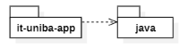
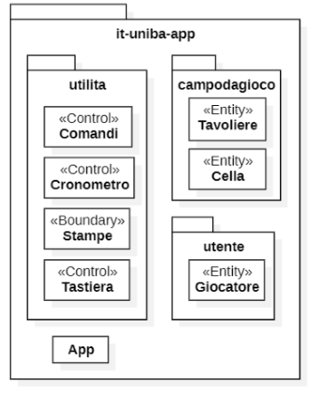
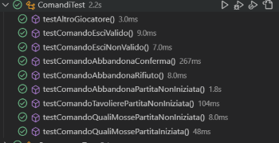
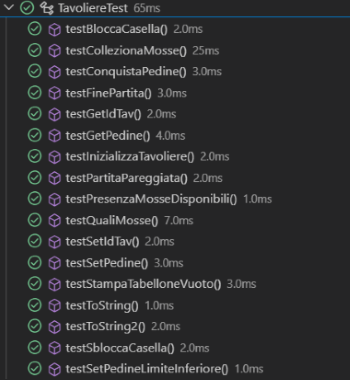
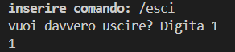

# Report del gioco _Ataxx_
## Gruppo _Codd_

### Indice

1. [Introduzione](#1-introduzione)
2. [Modello di dominio](#2-modello-di-dominio)
3. [Requisiti specifici](#3-requisiti-specifici)
   - 3.1 [Requisiti funzionali](#31-requisiti-funzionali)
   - 3.2 [Requisiti non funzionali](#32-requisiti-non-funzionali)
4. [System Design](#4-system-design)
5. [OO Design](#5-oo-design) 
6. [Riepilogo del test](#6-riepilogo-del-test)
7. [Manuale Utente](#7-manuale-utente)
8. [Processo di sviluppo e organizzazione del lavoro](#8-processo-di-sviluppo-e-organizzazione-del-lavoro)
9. [Analisi retrospettiva](#9-analisi-retrospettiva)
   - 9.1 [Sprint 0](#91-sprint-0)
   - 9.2 [Sprint 1](#92-sprint-1)

# **1. Introduzione** 

### Gruppo **_Codd_**
Costituito dagli studenti: _Bitetti Andrea, Castellano Leoluca, Di Pietro Claudio, Fallucca Giuseppe Pio, Franco Andrea, Gatti Giovanni_.

### Obiettivo
L'obiettivo del progetto, a noi assegnato, è riprodurre il gioco di strategia _Ataxx_ e permette all'utente di scontrarsi in un match 1 vs 1.
In particolare sarà possibile giocare utilizzando un'interfaccia a riga di comando, sviluppata in linguaggio _Java_.

### **Scopriamo _Ataxx_**

_Ataxx_ è un videogioco di strategia pubblicato nelle sale giochi da Leland Corporation nel 1990. Due giocatori competono su una griglia quadrata 7x7. Lo scopo del gioco è che un giocatore abbia la maggioranza dei pezzi sul tabellone alla fine del gioco, convertendo il maggior numero possibile di pezzi dell'avversario.

L'obiettivo del gioco è riempire la griglia dello schermo con la propria pedina. Questo avviene muovendo la propria pedina vicino a quella dell'avversario e facendola diventare del proprio colore
Possono essere effettuate due tipi di mosse:
1. posizionare una pedina a fianco di un'altra tua, la duplica;
2. saltare con una pedina di due posizioni, ma essa non verrà duplicata.

Il numero ed il posizionamento degli ostacoli sul campo di gioco cambia ad ogni round, per cui la strategia del giocatore deve essere adattata agli ostacoli.
Quando tutti gli spazi vuoti verranno riempiti, il giocatore che avrà mangiato tutte le pedine dell'avversario vincerà la partita.

### **Progettazione**

Il progetto è stato sviluppato in 3 sprint:
- _Sprint 0._ Dimostrare familiarità con Git, GitHub Flow e il processo agile
- _Sprint 1._ Piccoli comandi
- _Sprint 2._ Completare il gioco, assicurando la qualità del software

### **Cenni sulla storia e versioni del gioco**

Originariamente chiamato Infection, il gioco è stato inventato da Dave Crummack e Craig Galley nel 1988 per Wise Owl Software, che poi ha venduto i diritti a Virgin Mastertronic UK.
Alla fine, il gioco fu acquistato dalla Virgin Mastertronic US, che lo concesse in licenza alla società Leland, che lo pubblicò poi come gioco arcade Ataxx nel 1990. 

Nel 1993, la Virgin pubblicò il gioco The 7th Guest, prodotto da Trilobyte, che contiene una versione di Ataxx come Microscope Puzzle. 

Hexxagōn, un gioco compatibile con PC IBM creato da Argo Games e pubblicato da Software Creations nel 1993, utilizza una tavola esagonale, così come il sequel del 1995 di The 7th Guest, The 11th Hour.

Boogers è una variante online per 4 giocatori ospitata da ImagiNation Network, una rete di giochi dial-up pre-Internet. Da due a quattro giocatori combattono su un tabellone 9x9.

Il gioco educativo Sierra Mega Math include un clone di Ataxx in cui il giocatore deve rispondere a domande di matematica per muoversi.

Molti giochi sviluppati in modo indipendente hanno preso in prestito il concetto Ataxx.

# **2. Modello di dominio**
Di seguito viene presentato il modello di dominio del gioco _Ataxx_.
Tale modello è utile per comprendere e comunicare i concetti
fondamentali di un ambito. E’ indipendente dal software ed è sviluppato mediante un diagramma delle classi con prospettiva concettuale.

# **3. Requisiti specifici**
I requisiti specifici analizzano una particolare caratteristica o funzionalità richiesta per l'applicazione, ed esplicitano 'cosa' l'applicazione deve avere, senza dire 'come' una funzionalità verrà implementata.
I requisiti si suddividono principalmente in due categorie:
- Requisiti funzionali (abbreviati in FR): rappresentano le funzionalità o le caratteristiche principali che un sistema software deve possedere per soddisfare lo scopo previsto.

    In termini più semplici, questi requisiti specificano cosa dovrebbe fare il sistema. Descrivono le interazioni tra il software e i suoi utenti, nonché il comportamento del software in varie condizioni.
- Requisiti non funzionali (abbreviati in NFR): completano i requisiti funzionali specificando come un sistema software dovrebbe eseguire determinate funzioni. Definiscono le qualità, le caratteristiche e i vincoli del sistema piuttosto che le sue caratteristiche specifiche. 

    In sostanza, i requisiti non funzionali stabiliscono gli standard per le prestazioni, la sicurezza e l'usabilità del sistema.
Questi requisiti si concentrano su aspetti come prestazioni, sicurezza, usabilità, affidabilità e compatibilità dell'applicazione
## **3.1 Requisiti funzionali**
- **FR1: Come giocatore voglio mostrare l'help con elenco comandi**   
_Criteri di accettazione_

    Al comando **_/help_** o invocando l'app con flag **_help_** o **_-h_**
    
    Il risultato è una descrizione concisa, che normalmente appare all'avvio del programma, seguita dalla lista di comandi disponibili, uno per riga, come da esempio successivo:
    - gioca
    - esci
    - gioca
    -  esci
    - qualimosse
    - tavoliere
    - vuoto
    - abbandona

- **FR2: Come giocatore voglio iniziare una nuova partita**   
_Criteri di accettazione_

    Al comando **_/gioca_** se nessuna partita è in corso l'app mostra il tavoliere con le pedine in posizione iniziale come in figura e si predispone a ricevere la prima mossa di gioco del nero o altri comandi.

- **FR3: Come giocatore voglio mostrare il tavoliere vuoto con la numerazione**   
_Criteri di accettazione_

    Al comando **_/vuoto_** l'app mostra il tavoliere vuoto di 49 caselle quadrate (7 per lato) con le righe numerate da 1 a 7 e le colonne numerate da ‘a’ a ‘g’

- **FR4: Come giocatore voglio mostrare il tavoliere con le pedine e la numerazione**   
    _Criteri di accettazione_
    
    Al comando **_/tavoliere_**
    - se il gioco non è iniziato l'app suggerisce il comando **_/gioca_**
    - se il gioco è iniziato l'app mostra la posizione di tutte le pedine sul tavoliere; le pedine sono mostrate in formato Unicode https://en.wikipedia.org/wiki/English_draughts#Unicode

- **FR5: Come giocatore voglio visualizzare le mosse possibili di una pedina**  
_Criteri di accettazione_
    
    Al comando **_/qualimosse_**
    -  se il gioco non è iniziato l'app suggerisce il comando **_/gioca_**
    -  se il gioco è iniziato l'app mostra quali mosse sono disponibili per il giocatore di turno, evidenziando
        - a) in giallo le caselle raggiungibili con mosse che generano  una nuova pedina
        - b) in arancione raggiungibili con mosse che consentono un salto
        - c) in viola le caselle raggiungibili con mosse di tipo a) o b)

- **FR6: Come giocatore voglio abbandonare la partita**  
_Criteri di accettazione_

    Al comando **_/abbandona_** l'applicazione chiede conferma
    - se la conferma è positiva, l'app comunica che il giocatore A (o giocatore B) ha vinto per abbandono e dichiara come vincitore l’avversario per x a 0,

        dove x è il numero di pedine rimaste dell’avversario.
    - se la conferma è negativa, l'app si predispone a ricevere nuovi tentativi o comandi

- **FR7: Come giocatore voglio chiudere il gioco**  
_Criteri di accettazione_

    Al comando **_esci_**
    - se la conferma è positiva, l'app si chiude restituendo il controllo al sistema operativo
    - se la conferma è negativa, l'app si predispone a ricevere nuovi tentativi o comandi

- **FR8: Come giocatore voglio giocare una nuova pedina in una casella adiacente a una propria pedina**

    _Criteri di accettazione_

    A partita in corso di gioco, l'applicazione deve accettare che il giocatore di turno giochi sul tavoliere una nuova pedina ((bianca o nera) in una casella adiacente (in senso ortogonale e diagonale) ad un'altra in cui vi sia già una propria pedina, utilizzando una notazione algebrica del tipo: a1-a2, dove a1 è la casella di partenza e a2 è la casella adiacente.

- **FR9: Come giocatore voglio spostare una propria pedina saltando una casella adiacente**
_Criteri di accettazione_

    A partita in corso di gioco, l'app deve accettare che il giocatore di turno sposti sul tavoliere una propria pedina ((bianca o nera) con il salto di una casella adiacente, utilizzando una notazione algebrica del tipo: a1a3, dove a1 è la casella di partenza e a3 è la casella di arrivo.
    La casella di arrivo deve essere libera e non deve essere adiacente alla casella originaria. La casella saltata può anche essere occupata da una propria pedina o da una pedina avversaria.

- **FR10: Come giocatore voglio catturare una pedina avversaria come effetto di una mossa**

    _Criteri di accettazione_
    
    Se al termine di una mossa vi sono pedine avversarie adiacenti alla casella di arrivo, sia per la mossa di espansione che di spostamento, queste vengono catturate cambiando di colore

- **FR11: Come giocatore voglio mostrare le mosse giocate**

    _Criteri di accettazione_
    
    Al comando _/mosse_, l'app mostra la storia delle mosse con notazione algebrica, per esempio: 1. a1-a2 (N); 2. g7-g6 (B);

- **FR12: Come giocatore voglio passare il turno per impossibilità di movimento**

    _Criteri di accettazione_

    Se il giocatore non può muovere nessuna pedina del proprio colore, l’app avvisa che il turno passa all’altro colore.
    
- **FR13: Come giocatore voglio visualizzare il fine partita con il vincitore e i punti segnati**
    
    _Criteri di accettazione_

    Se nessuna pedina può essere mossa perché le caselle del tavoliere sono state tutte riempite, allora l’app dichiara il vincitore (Bianco o Nero) e riporta i punti del Bianco e Nero contando le rispettive pedine.
    L'app si predispone a ricevere nuovi comandi.

- **FR14: Come giocatore voglio mostrare il tempo di gioco**

    _Criteri di accettazione_

    Al comando _/tempo_, l'app mostra il tempo trascorso dall’inizio partita nel formato ore:minuti:secondi.

- **FR15: Come giocatore voglio impostare caselle non accessibili**
    
    _Criteri di accettazione_

    A partita non in corso, al comando /blocca xn, dove xn sono le coordinate di una casella, la casella xn non è accessibile per le pedine ed è mostrata sul tavoliere con uno sfondo grigio.
    Non è possibile bloccare:
    - le caselle di partenza del gioco 
    - tutte le caselle adiacenti a una casella di partenza del gioco, rendendo impossibile la mossa di espansione di una pedina a inizio gioco
    - tutte le caselle a distanza 2 da una casella di partenza del gioco, rendendo impossibile la mossa di salto di una pedina a inizio gioco.
    
    Non è possibile bloccare più di 9 caselle.

## **3.2 Requisiti non funzionali**
- **NFR1**  
Il container docker dell’app deve essere eseguito da terminali che supportano Unicode con encoding UTF-8 o UTF-16.

    Elenco di terminali supportati:
    - **Linux:**
        - terminal
    - **Windows:**
        - Powershell
        - Git Bash (in questo caso il comando Docker ha come prefisso winpty; es: winpty docker -it ....)

    **Comando per l’esecuzione del container**
Dopo aver eseguito il comando docker pull copiandolo da GitHub Packages, Il comando Docker da usare per eseguire il container contenente l’applicazione è:
    

        docker run --rm -it ghcr.io/softeng2324-inf-uniba/ataxx-base:latest
    

    
    dove _base_ sarà sostituito con il nome del gruppo.

# **4. System Design**
### Diagramma dei package
La struttura del sistema è gestita in più package e sottopackage.

Partendo dal livello più alto, il package _main/java/it/uniba/app_ contenuto nella cartella src della repository contiene il codice del gioco _Ataxx_. In figura la rappresentazione:

Scendendo di livello troviamo i package che contengono le classi necessarie al funzionamento del gioco, divisi in base a necessità, quali ordine, logica del gioco e migliore implementazione di quest'ultimo:

Il diagramma dei package completo è il seguente:

### Diagramma dei componenti

### Commento sulle decisioni prese
Lo stile architetturale da noi adottato è l'ECB (Entity-Control-Boundary). Si è deciso di adottare questo stile poichè gode di  innumerevoli vantaggi come la separazione ben definita delle responsabilità fra classi Entity (manipolazione dei dati), Boundary (grafica)  e Control (interazioni tra i due sottosistemi).

In fase di sviluppo sono stati adottati i principi generici per garantire un software di qualità, questi ultimi vengono analizzati dettagliatamente nel paragrafo successivo. 

# **5. OO Design**
Si è deciso di analizzare dettagliamente tutte le user story e definire quali consideriamo più imporanti.
    
### FR2: Come giocatore voglio iniziare una nuova partita
Diagramma delle classi:

Diagramma di sequenza:

### FR7: Come giocatore voglio chiudere il gioco  
Diagramma delle classi:

Diagramma di sequenza:

### FR15: Come giocatore voglio impostare caselle non accessibili
Diagramma delle classi:

Diagramma di sequenza:

Le scelte sono state effettuate seguendo i principi dell'OO Design.
### Principi OO Design
- **Information hiding**

    Per quanto rigurda i package, solo le classi strettamente necessarie sono pubbliche. Si cerca di rendere le maggior parte private.
    Lo stesso avviene nelle classi, con l'aggiunta che tutti gli attributi (o almeno la maggior parte) sono resi privati (incapsulamento dei dati) e vengono acceduti mediante i metodi _get_ e _set_.

- **Alta coesione**

    Ogni componente o classe del progetto ha una responsabilità ben definita.
    Si pone l'obiettivo di assegnare le responsabilità in modo tale da ottenere componenti con responsabilità ben definite.

- **Basso accoppiamento**
 
    Necessità che un cambiamento a un componente non si propaghi a tutti gli altri, quindi non avendo forti dipendenze tra essi.
    Un alto accoppiamento si risolve applicando il principio di information hiding

- **Presentazione separata**

    E' necessario che la parte di codice relativa alla presentazione (grafica di gioco) sia tenuta separata dal resto dell’applicazione.

- **Do Not Repeat Yourself (DRY)**

    Questo principi afferma che ogni parte significativa di una funzionalità dovrebbe essere implementata in un unico posto del codice sorgente
    evitando sequenze di istruzioni uguali fra loro.
    Per questo è stato utile utilizzare classi già implementate in _Java_ (es. _Scanner_)

- **Principi SOLID** 
    - **Single Responsibility**: ogni classe ha una sola responsabilità
    - **Open-Closed**: le classi sono aperte all'estensione e chiuse alle modifiche mediante i modificatori di accesso
    - **Liskov Substitution**
    - **Interface Segregation** (non sono state utilizzate interfacce)
    - **Dependency Inversion**: le classi che implementano i comandi dipendono esclusivamente dalla classe _Utilità_

# **6. Riepilogo del test**
### Informazioni sul criterio di selezione, localizzazione e numero dei casi di test
Nello Sprint 2  il team ha effettuato l'attività di _V&V_ (
Verification and validation) ossia test del codice _Java_.
E' possibilie suddividere tale attività in:
- processo statico: analisi del codice con i plugin Checkstyle, Spotbugs e PMD
- processo dinamico: creazione di casi di test con framkework JUnit5 e verifica del funzionamento dei metodi

## Processo statico
In seguito vengono mostrati i risultati dell'analisi del codice

**CheckStyle e PMD**

CheckStyle e PMD sono framework che abbiamo implementato nel nostro IDE, in particolare dopo aver implementato i file necessari, sono stati effettuati i controlli sul codice. Qualora ci fossero errori, sono stati corretti.

**Spotbugs**

   

## Processo dinamico
Riguardo il processo dinamico, in seguito vengono mostrati i risultati dei test effettuati sui metodi.

**Sommario testing con JUnit**

Sono stati effettuati casi di test su tutti i metodi, con parametri ed oggetti differenti. Alleghiamo il sommario:

In particolare per ogni test suite, sono stati effettuati test su tutti i metodi:

 

 

 

### Cenni sul testing con JUnit5
Per le classi di tipo Entity e Control, è stati adottato il criteri di tipo black box. Per ciascun metodo, il dominio dei dati in ingresso è stato suddiviso in classi di equivalenza e sono stati scelti valori appropriati per ciascuna classe. Per le classi boundary, non sono stati eseguiti test.

Sono state create varie test suite dove sono stati effettuati i test, ognuno dei quali superato con successo.
Ogni test suite, opportunamente inserita nella cartella _test_ del repository, corrisponde a una classe del codice sorgente ed è stata denominata "_nomeclasse_ Test.java".

# **7. Manuale utente**
Il manuale utente permette all'utente di capire come utilizzare il software, dove poterlo scaricare e quali sono i comandi principali del gioco. Il presente volume è stato prodotto come supporto formativo all’utilizzo del gioco.

### Terminali che supportano il gioco

Ecco una lista di terminali che supportano il gioco su diversi sistemi operativi:
   - Linux e macOS:    *terminal*
   - Windows: *Powershell*, *GitBash*

### Dove scaricare il gioco
E' possibile scaricare il gioco sul sito di [GitHub](https://github.com/) attraverso il link [Ataxx - Gruppo Codd](https://github.com/softeng2324-inf-uniba/progetto-codd.git) all'interno del quale sarà possibile avviare il gioco. 

Il giocatore, per avviare correttamente il gioco, deve aver precedentemente installato [Docker Desktop](https://www.docker.com/products/docker-desktop/).

Successivamente, per avviare il gioco, fare riferimento alla sezione 
 [Requisiti non funzionali](#32-requisiti-non-funzionali) del Report. Per altri problemi, vedere [Guida per lo studente](https://github.com/softeng2324-inf-uniba/progetto-codd/blob/main/docs/Guida%20per%20lo%20studente.md)

### Informazioni generali sul gioco
Per giocare non è necessaria alcuna registrazione utente. Il gioco è sviluppato in modo che due utenti differenti giochino sullo stesso schermo, pertanto devono inserire il proprio nickname durante la fase iniziale di gioco.

La griglia di gioco è costituita da celle di colore bianco e nero alternato, tali colori non differiscono tra loro per quanto riguarda azioni specifiche che il giocatore compie posizionandosi su di essi.

### Regole di gioco

- ### **Visualizzare i comandi di gioco**

    All'avvio del programma, al giocatore gli viene suggerito di digitare il comando **__/help__** (o invocando l'app con flag **_-help_** o **_-h_**.) per visualizzare i comandi disponibili.
    Tale comando può essere richiamato in qualsiasi momento di gioco.

    

- ### **Iniziare una partita**
    Per iniziare la partita, digitare il comando **_/gioca_**. 
    L'utente inserisce i nickname dei due giocatori.
    Ora è possibile effettuare le mosse e provare a vincere la partita.
    Quando sullo schermo compare la griglia vuota con le pedine in posizione iniziale, come in figura, si predispone a ricevere la prima mossa di gioco del nero o altri comandi.

    

- ### **Visualizzare il tavoliere vuoto con la numerazione**
    Per visualizzare il tavoliere vuoto di 49 caselle quadrate (7 per lato) con le righe numerate da 1 a 7 e le colonne numerate da ‘a’ a ‘g’, digitare il comando **_/vuoto_**.

    

- ### **Visualizzare il tavoliere con le pedine e la numerazione**
    Digitando il comando **_/tavoliere_** sarà possibile, se il gioco è iniziato, visualizzare la posizione di tutte le pedine sul tavoliere (come in figura).

    

- ### **Visualizzare le mosse possibili di una pedina**
    Se il gioco è iniziato, digitando il comando **_/qualimosse_**, è possibile vedere quali mosse sono disponibili per il giocatore di turno.

    Ogni pedina colorata evidenzia un tipo diverso di mossa, in particolare sono evidenziate:
    1. in giallo le caselle raggiungibili con mosse che generano una nuova pedine
    2. in arancione mosse che consentono un salto
    3. in viola le caselle raggiungibili con mosse di tipo 1. o 2.

    

- ### **Vincere una partita**
    La vittoria della partita è possibile in due distinti casi:
    1. il giocatore avversario abbandona la partita
    2. il giocatore ha riempito la griglia con le proprie pedine

- ### **Giocare una nuova pedina in una casella adiacente ad una propria pedina**
    A partita in corso, l'utente può spostare una propria pedina in una casella adiacente, in senso ortogonale e diagonale.
    Utilizzare la notazione algebra del tipo: a1-a2, dove a1 è la casella di partenza e a2 è la casella adiacente.

    

- ### **Spostare una propria pedina saltando una casella adiacente**
    A partita in corso, l'utente può spostare una propria pedina in unacasella non adiacente, saltandola.
    Utilizzare la notazione algebra del tipo: a1-a3, dove a1 è la casella di partenza e a3 è la casella adiacente.
    La casella di arrivo deve essere libera e non deve essere adiacente alla casella originaria. La casella saltata può anche essere occupata da una propria pedina o da una pedina avversaria.
    
    

- ### **Mostrare le mosse giocate**
    E' possibile visualizzare la storia delle mosse effettuate utilizzando il comando /mosse. L'utente visualizza la seguente grafica.

    

- ### **Passare il turno per impossibilità di movimento**
    Se il giocatore non può muovere nessuna pedina del proprio colore, l’app avvisa che il turno passa all’altro colore

- ### **Mostrare il tempo di gioco**   
    Utilizzando il comando /tempo, l'app mostra il tempo trascorso dall’inizio partita nel formato ore:minuti:secondi.

    

- ### **Impostare caselle non accessibili**
    A partita non in corso, l'utente può bloccare alcune caselle, rendendole inaccessibili da entrambi i giocatori.
    Utilizzare il comando /blocca xn, dove xn sono le coordinate di una casella. La casella xn è mostrata sul tavoliere con uno sfondo grigio. Non è possibile bloccare:
    - le caselle di partenza del gioco
    - tutte le caselle adiacenti a una casella di partenza del gioco
    - tutte le caselle a distanza 2 da una casella di partenza del gioco

    Non è possibile bloccare più di 9 caselle.
    
    

- ### **Abbandonare una partita**
    Qualora si volesse abbandonare una partita, digitare il comando **_/abbandona_**.
    Successivamente l'applicazione chiede conferma, pertanto digitare '1' se si vuole confermare la scelta.

    Se la conferma è positiva, l'app comunica che il giocatore ha vinto per abbandono e dichiara come vincitore l’avversario per x a 0, dove x è il numero di pedine rimaste dell'avversario. 

    Se la conferma è negativa, l'app si predispone a ricevere nuovi tentativi o comandi.

    

- ### **Uscire da una partita**
    Qualora si volesse abbandonare una partita, digitare il comando **_/abbandona_**.
    Successivamente l'applicazione chiede conferma, pertanto digitare '1' se si vuole confermare la scelta.

    Se la conferma è positiva, l'app comunica che il giocatore ha vinto per abbandono e dichiara come vincitore l’avversario per x a 0, dove x è il numero di pedine rimaste dell'avversario. 

    Se la conferma è negativa, l'app si predispone a ricevere nuovi tentativi o comandi.

    

### Buon divertimento... e che vinca il migliore!

# **8. Processo di sviluppo e organizzazione del lavoro**
### Processo di Sviluppo
Per la realizzazione del progetto abbiamo scelto di adottare il processo di sviluppo Agile, in particolare nella categoria _piccoli e medi progetti_ si è deciso di operare seguendo un approccio _Scrum_.
Alla base del processo di sviluppo sono stati seguiti i principi dettati dal _Manifesto per lo Sviluppo Agile di Software_. In generale si fa riferimento al [codice di condotta](./CODE_OF_CONDUCT.md).

Il progetto è stato strutturato in 3 principali Sprint, che corrispondono a precise parti del lavoro, ognuno dei quali con obiettivi ben definiti.
Anticipatamente, rispetto l'inizio di ogni Sprint, il team ha svolto un meeting di retrospettiva con l'obiettivo di eseguire una revisione dello Sprint precedente al fine di individuare problematiche riscontate e sintetizzare i miglioramenti da effettuare.

Il professore ha svolto il ruolo di _Product Owner_. Per ogni Sprint, sono stati comunicati i requisiti tramite piattaforma Microsoft Teams, sotto forma di _Definition of Done_ e le user-story.

Il team ha utilizzato la piattaforma GitHub, lavorando sulla repository assegnata dal professore, a cui ogni membro ha acceduto.
Il team ha provveduto a realizzare una Board per ogni Sprint che raccoglie in maniera ordinata le issue relative agli obiettivi definiti per il dato Sprint e permette di definire la situazione di lavoro del team.

La Board è stata gestita utilizzando la sezione Project di GitHub, utilizzando una struttura fissa per tutti gli Sprint.
E' costituita da 5 sezioni rettangoli, definiti così:
- **To Do**: task da risolvere
- **In Progress**: task prese in carico dall'utente ed in sviluppo
- **Review**: task risolte, in attesa di revisione
- **Ready**: task risolte e revisionate dai reviewers
- **Done**: task completati, revisionati dai reviewers ed approvate dal Product Owner

Per la gestione dello sviluppo dei task è stato utilizzato il Github Flow:
per ogni issue, identificata con nome significativo, è stato creato un branch da parte del membro del team a cui è stata assegnata la issue. Una volta che il componente, ha concluso il suo lavoro, effettuava il caricamento del materiale nel repository.

Tale caricamento è stato sottoposto a revisione da parte di un altro membro, che chiameremo reviewer. Mediante la Pull Request, si discutevano eventuali problemi e/o migliorie per portare a termine lo specifico task.
Una volta approvata la Pull Request, il branch dell'issue viene unito al branch principale. Infine la Pull Request viene eliminata.

### Tempi di lavoro
La seguente tabella ha il compito di analizzare i tempi di lavoro previsti da calendario per ogni Sprint:

### Organizzazione del Lavoro
Per coordinare il lavoro, comunicare ed effettuare i meeting, il gruppo ha utilizzato diverse piattaforme (in particolare Whatsapp e Discord). Questi strumenti hanno facilitato la condivisione di file, immagini e documentazione, nonché la discussione dei problemi incontrati durante lo sviluppo.

In particolare, Whatsapp è stato utilizzato per stabilire giorno ed orario dei meeting periodici, svolti in generale ogni settimana.
I meeting  sono stati svolti su Discord, dove è stato creato un server privato del team, con canali specifici per mantenere l'ordine e l'organizzazione.

### Software utilizzati
Per lo svolgimento dei task sono stati utilizzati diversi software, in particolare:

**Organizzazione del lavoro:**
- _Microsoft Teams_, in cui venivano definiti i compiti per ogni Sprint;
- _Discord_, per i meetings del team
- _Whatsapp_, per organizzare e definire i meetings

**Ambienti di sviluppo:**
- _Visual Studio Code_, per la scrittura del codice delle funzioni di gioco e per il controllo degli errori CheckStyle
- _IntelliJ IDEA_, per il controllo degli errori

**Editor per file Markdown:**
- _Visual Studio Code_, per la scrittura del testo in formato Markdown e l'immediata visione del file risultante

**Software per la creazione dei diagrammi:**
- _StarUML_, per la creazione dei diagrammi (es. Modello di dominio).

**Software per il diagramma dell'analisi retrospettiva:**
- _Canva_, software online per la creazione di tabelle personalizzabili

**Software per il testing:**
- _JUnit5_, framework integrato in Visual Studio Code, per il testing delle funzioni con l'obiettivo di rilevare errori e correggerli
- _Spotbugs_, software per effettuare controlli necessari sul codice

# **9. Analisi retrospettiva**
L'analisi retrospettiva è una pratica utilizzata dal team per analizzare ciò che è stato svolto durante uno _Sprint_, valutare il lavoro svolto, analizzare gli errori e fissare le lezioni apprese.

Grazie all'analisi retrospettiva, i componenti si riuniscono per discutere i dettagli di un imprevisto: perché si è verificato, il suo impatto, quali azioni sono state intraprese per risolverlo e cosa fare per impedire che si verifichi nuovamente.

Si tratta di una valutazione riflessiva che coinvolge tutti i membri del team e incoraggia una comunicazione aperta e onesta.
Il team si riunisce in un incontro dedicato alla fine di uno _Sprint_.

L'analisi retrospettiva utilizzata in questo progetto è la **_"Arrabbiato, triste, felice"_**, un metodo efficace per condurre un'analisi approfondita dei sentimenti e delle emozioni del team durante un progetto o un'iterazione.

Questo approccio incoraggia i partecipanti a esprimere ciò che li rende felici, ciò che li rende tristi e ciò che li fa arrabbiare. 

Il giorno successivo ad ogni review dello Sprint, abbiamo effettuato un meeting per svolgere l'analisi retrospettiva. E' stata sviluppata la tabella _"Arrabbiato, triste, felice"_ e sono state elencate le principali azioni correttive da intraprendere.

## **9.1 Sprint 0**
Il modello Retrospettiva **_"Arrabbiato, triste, felice"_** dello _Sprint 0_ è il seguente:

Durante l'analisi retrospettiva dello Sprint 0, abbiamo stilato un elenco delle azioni correttive da intrapendere, scaturito dalla discussione avvenuta precedentemente:

-	Non avendo mai avuto esperienze simili, a partire dallo Sprint 1 ci sarà una migliore divisioni dei compiti, oltre a definire dettagliata cosa ogni membro debba fare.

-	La poca conoscenza del software _GitHub_ ha portato a dover svolgere un lungo studio sulla parte di gestione delle issue e pull request. Nel prossimo Sprint saremo molto più efficienti.

-	Tutti i componenti hanno apprezzato l'entusiasmo e l'impegno degli altri membri del team nel conoscere e studiare una piattaforma mai utilizzata.

-   E' stato semplice capire come dal prossimo Sprint bisogna avere maggior fiducia negli altri membri del team.

## **9.2 Sprint 1**
Il modello Retrospettiva **_"Arrabbiato, triste, felice"_** dello _Sprint 1_ è il seguente:

Durante l'analisi retrospettiva dello Sprint 1, abbiamo stilato un elenco delle azioni correttive da intrapendere, scaturito dalla discussione avvenuta precedentemente:

-	Avremmo potuto adottare soluzioni più semplici per risolvere l'user-story del comando _/qualimosse_. Una analisi più lunga e dettagliata dei requisiti richiesti, avrebbe ridotto il tempo di lavoro. D'altra parte siamo soddisfatti del lavoro finale.

-   Inizialmente abbiamo incontrato delle difficoltà nell'implementazione del diagramma delle classi, poichè lo analizzavamo dal punto di vista software.

-   E' stato appurata l'importanza nel fare attenzione agli errori di logica del software, per evitare eventuali bugs che portano a gravi perdite di tempo.

-	Abbiamo riscontrato difficoltà nell'accordarsi sulle scelte riguardo il software da intraprendere in alcune circostanze.

Questi feedback saranno presi in considerazione durante lo svolgimento dello Sprint 2, per migliorare il processo di sviluppo e l'ottimizzazione delle funzioni create nello Sprint 1.
Continueremo a lavorare ottimizzando i tempi di lavoro e la divisione del carico di lavoro.